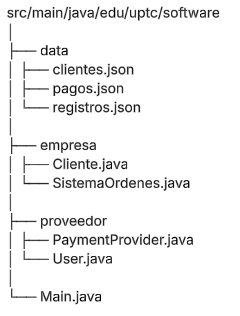
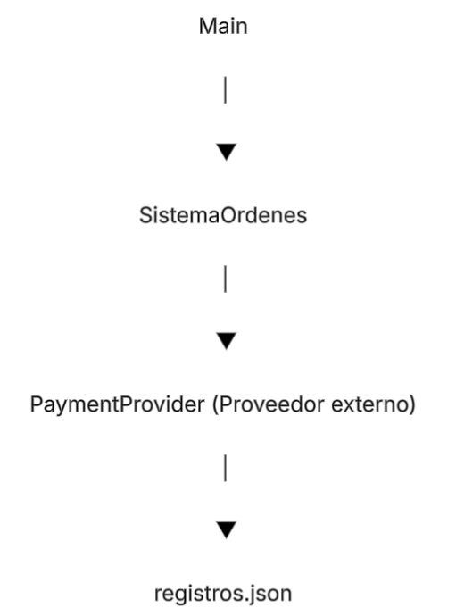
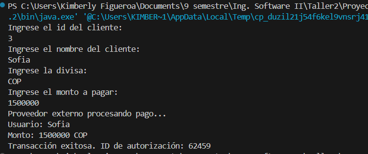
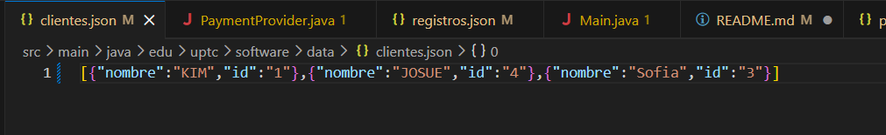
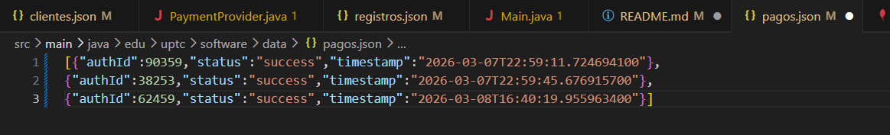
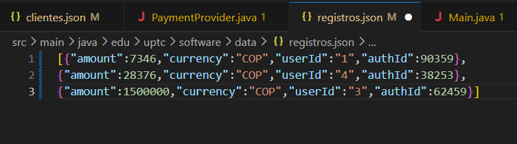
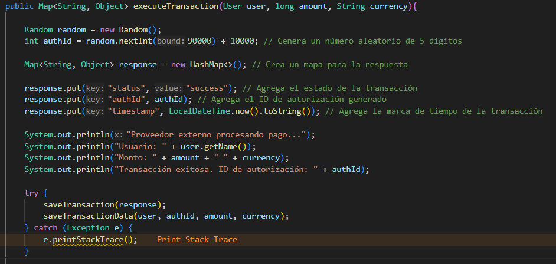
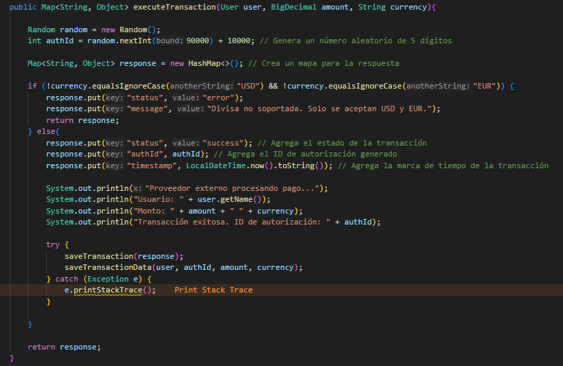
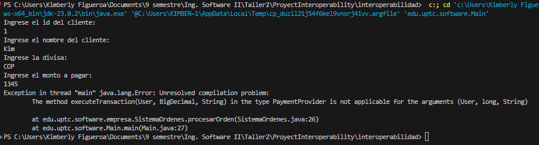
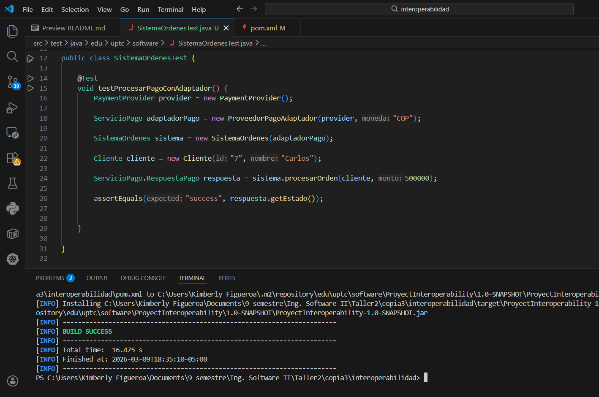

# interoperabilidad
Proyecto de análisis para aprender a usar el patrón Adapter

# Paso 1- Implementación ingenua (acopada)

## Descripción del sistema

Sistema básico de procesamiento de pagos en Java, donde existe un sistema principal (sistema de la empresa) y un sistema proveedor. El sistema principal se encarga de crear ordenes y procesar pagos mediante el proveedor, el sistema actual en el PASO 1 permite:
- Registrar usuario
- Ejecutar transacciones de pago
- Simular la comunicación con un proveedor externo
- Guardar registros de las transacciones en un archivo JSON

## Arquitectura actual

El sistema está organizado en los siguientes paquetes:

- **empresa**  
  Contiene las clases principales del sistema, como la gestión de clientes y órdenes.

- **proveedor**  
  Simula el proveedor externo de pagos que procesa las transacciones.

- **data**  
  Archivos JSON utilizados para almacenar clientes y registros de transacciones.
  - `clientes.json`: Guarda el id y el nombre de los clientes
  - `pago.json`: se encarga de guardar la información que llega al proveedor, almacenando el authId, estado y la fecha con hora en la que se realizó el pagó
  - `registros.json` se encarga de guardar el monto del pago realizado, junto con la divisa en la que se realizó el pago, asociando el id del usuario y el id automatico del proveedor, con la finalidad de tener información completa de quien realizó el pago, fecha y hora, monto, divisas y el proveedor que Id le asignó al pagó

- **Main**  
  Punto de entrada de la aplicación.

- **Diagrama simple**

- **Main**  
  Punto de entrada de la aplicación. Donde se reciben los datos para relizar los pagos

- **SistemaOrdenes**
  En esta clase el sistema principal de la empresa se comunica con el sistema del proveedor para procesar el pagó, ademas de eso se realiza el respectivo registro del cliente en el archivo Json (`clientes.json`)

- **PaymentProvider** (Proveedor externo)
    En esta clase se ejecutan las transacciones y se realiza el respectivo registro de la información en los archivos Json (`pagos.json` y `registros.json`)

-**registros.json**
    Aqui se guarda el registro de los pagos realizados, asociando el id del cliente, el id automático que genera el proveedor y guardando información relevante como el monto y la divisa en la que se realizó el pago

-**Problema de acoplamiento**
  Actualmente hay un alto acoplamiento, ya que la el sistema principal depende directamente de la clase `PaymentProvider` del sistema del proveedor y de la estructura de datos que utiliza el mismo para procesar transacciones, de como este maneja los datos y los registra. Por ende el sistema principal debe acoplarse a la interfaz del proveedor, la cual usa el metodo executeTransaction(`user, amount, currency`) y retorna una estructura específica con los campos `authId` y `timestamp`. 

  Debido a esta dependencia directa, cualquier cambio de la interfaz del proveedor obligaría a modificar el sistema principal. 

-**Evidencia de ejecución**

Ejecución del programa

Información guardada en clientes.json

Información guardada en pagos.json

Información guardada en registros.json

# Paso 2 – Análisis de impacto del cambio

## Estructura del código inicial antes del cambio

En la implementación inicial se puede observar que el método `executeTransaction` del proveedor espera recibir los siguientes parámetros:

- `user` de tipo **User**
- `amount` (monto) de tipo **long**
- `currency` (divisa) de tipo **String**

Este método es el encargado de procesar y registrar los pagos realizados por el sistema principal.

---

## Estructura del código luego del cambio

Se simuló un cambio en la interfaz del proveedor externo. Los cambios realizados fueron los siguientes:

- El atributo **amount** cambió de tipo `long` a **BigDecimal**, ya que este tipo de dato permite manejar valores decimales y ofrece mayor precisión para operaciones financieras.

- Se agregó una validación en el método `executeTransaction`, donde ahora el proveedor solo acepta pagos en las divisas **USD** o **EUR**, rechazando cualquier otra moneda.

---

## Resultado de la ejecución después del cambio

Al ejecutar el sistema después de realizar estos cambios, se presentan errores debido a que el método `executeTransaction` ahora espera recibir parámetros de tipo:

- `User`
- `BigDecimal`
- `String`

Sin embargo, el método `procesarOrden` del sistema principal continúa enviando:

- `User`
- `long`
- `String`

Debido a esta incompatibilidad de tipos, el sistema principal deja de funcionar correctamente.

---

## Impacto del cambio

Este escenario demuestra que el sistema principal está **fuertemente acoplado** a la interfaz del proveedor externo. 

Cuando el proveedor modifica su contrato (por ejemplo, cambiando tipos de datos o restricciones de negocio), el sistema interno se ve obligado a modificar su propia implementación para poder seguir utilizando el servicio externo.

En este caso, el sistema de la empresa tendría que:

- Cambiar el tipo de dato `long` a `BigDecimal` en diferentes partes del sistema.
- Adaptarse a la nueva restricción de divisas aceptadas por el proveedor.

Esto demuestra que el sistema interno depende directamente de la implementación del proveedor, lo que reduce la **flexibilidad, mantenibilidad y capacidad de adaptación del sistema**.

# Paso 5 – Validación mediante prueba automatizada mínima

En este paso se realizo una verificación mediante pruebas en la que se evidencio que el sistema de ordenes puede usar el proveedor de pagos externo a través dela adaptador, sin que el sistema depensa directamente de la implementación del proveedor

La clase de prueba implementada es `SistemaOrdenesTest.java`, en esta clase se utiliza **JUnit 5** para ejecutar pruebas automatizadas sobre el sistema

Flujo de la prueba:
1. El sistema `SistemaOrdenes` solicita procesar un pago
2. El sistema usa la interfaz ServicioPago
3. La llamada llega al ProveedorPagoAdaptador
4. El adaptador traduce la solicitud al PaymentProvider
5. El proveedor externo procesa el pago
6. El adaptador transforma la respuesta al formato interno del sistema

Este flujo demuestra que el sistema puede interoperar con un proveedor externo sin modificar su lógica

## Evidencia de la ejecución exitosa

Para la verificación del resultado se hace uso de `assertEquals` que usa **JUnit 5** para verificar que el resultado del pagp sea exitoso. La prueba confirma que:
- El adaptador funciona correctamente
- El sistema puede procesar pagos usando el proveedor externo
- La respuesta es interpretada correctamente por el sistema

Si el estado que devuelve fuera diferente a "success", la prueba fallaria

La ejecución del comando `mv clean install` mostro el resultado **BUILD SUCCES**. Esto significa que:
- El proyecto compila correctamente
- La prueba fue ejecutada sin errores
- El flujo completo del pago funciona mediante el adaptador